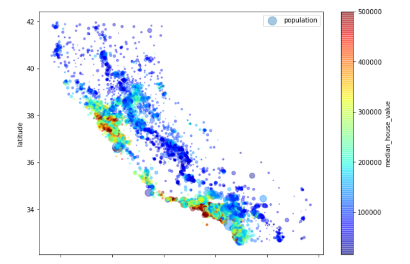
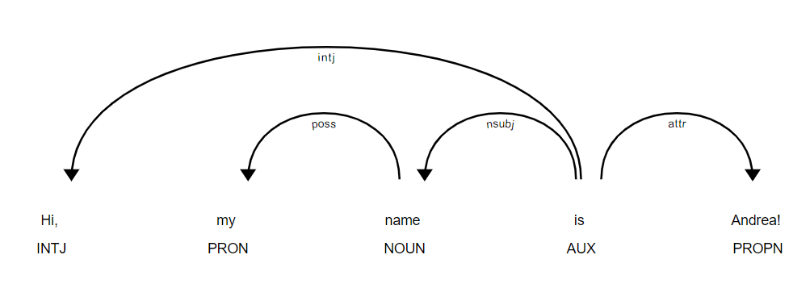
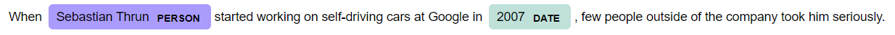
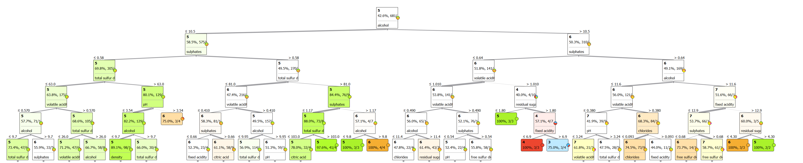
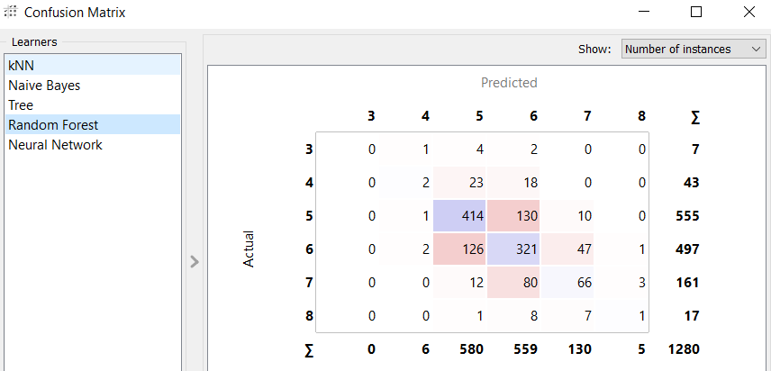
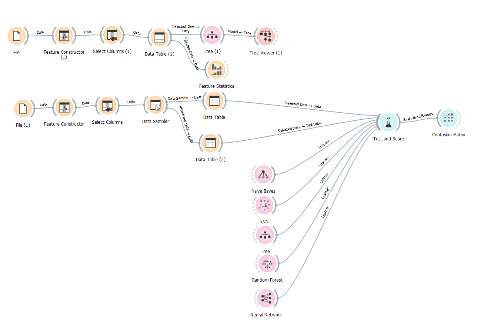

# HandsOnMachineLearning
This is just an academy machine-learning project where I want to collect any interesting problem/solution found during my journey.

You will need jupyter in the most of case

### Data analysis
- New York's houses analysis & prediction: `NewYorkHousesAnalysisAndPrediction.ipynb`

### Clustering
- dbscan-clustering: `plot_dbscan.ipynb`

### Speech tagging
- Spacy Visualizing for speech-tagging: `displacy_speech_tagging.ipynb`

 
  

### Sentiment Analysis
- Sentiment Analysis for movie-reviews: `nltkSentimentAnalysis.ipynb` or basic-python version at `nltkSentimentAnalysis.py`

### Prediction/Classification with Orange Data Mining
- Red wine quality prediction/classification: `wine_quality.ows`
  - dataset: `data/winequality-red.csv`
  - 3 <= qualities <= 8
    
 

 

 

### Binary Classification with Neura Networks in TensorFlow
- `BinaryClassificationNeura NetworksTensorFlow.ipynb`

 

#### Author
ciccottandrea@gmail.com